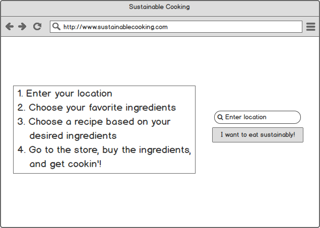
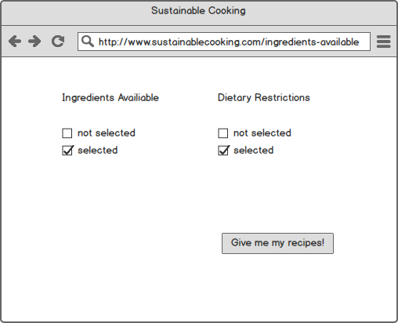
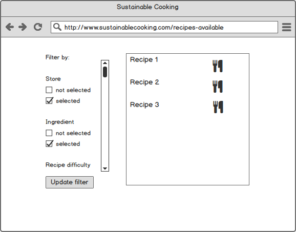
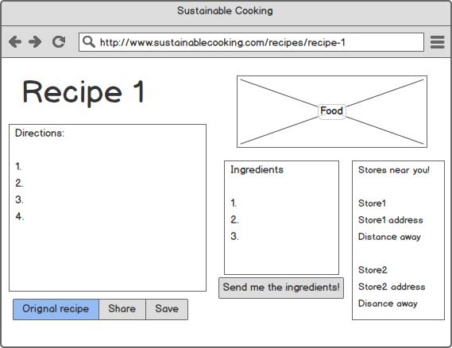

# comp20-f2017-team14

## Name of Project ##

### Problem Statement ###

People want to eat foods made with seasonal
products, but lack the information to do so

### Solution ###

Create an app that provides users with recipes that contain
foods that are currently in season in their area.

### Use Scenario ###

The app will take the user's location and provide a list of
products that are currently in season in their area. The
user will check off the products they want to use in their
recipe as well as indicate any dietary restrictions. The app
will provide them with a list of recipes based on those
parameters.

Once the user selects a recipe, they will be treated to
a page that has a picture of the finished product,
a list of ingredients, and a sequence of instructions for
making the recipe. There will also be options to copy the ingredients
to clipboard or to have the list sent to their phone via
SMS for convenience. There will also be a list of nearby farmer's
markets so the user can find out where they may be able  
purchase these ingredients.

### Features (Pick 3) ###

- Geolocation
- Front end framework
- SMS messaging

### Data Collected & Used ###

What foods are in season, based on their location
with data scraped from seasonalfoodguide.org

Nearby farmer's markets using the USDA Farmer's market
API

Recipes that contained specified foods, which we will
use the spooncular.com Food API to find

### APIs ###

- USDA Farmer's Market API
- spoocular.com Food API

### Algorithms and Techniques ###
We will need to scrape the seasonalfoodguide.org website
for data on what food is in season and parse the
data return from the APIs so it can be presented to
the user.

### Mockups ###

